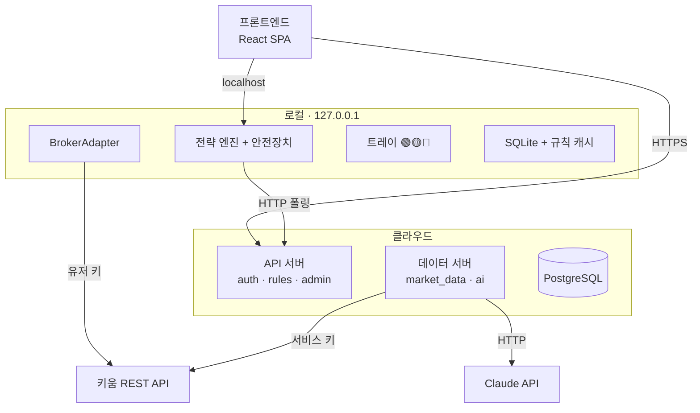
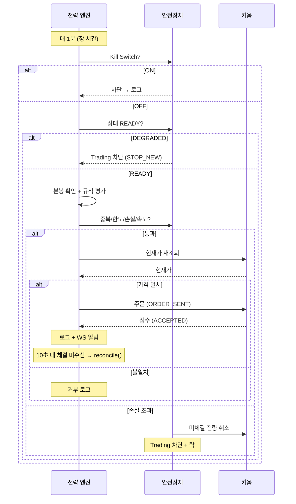
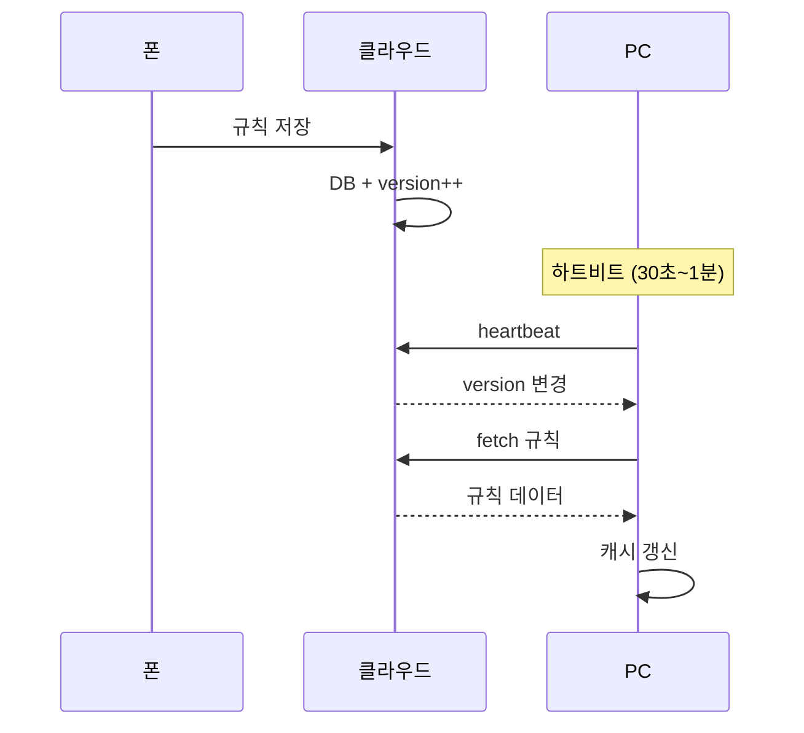
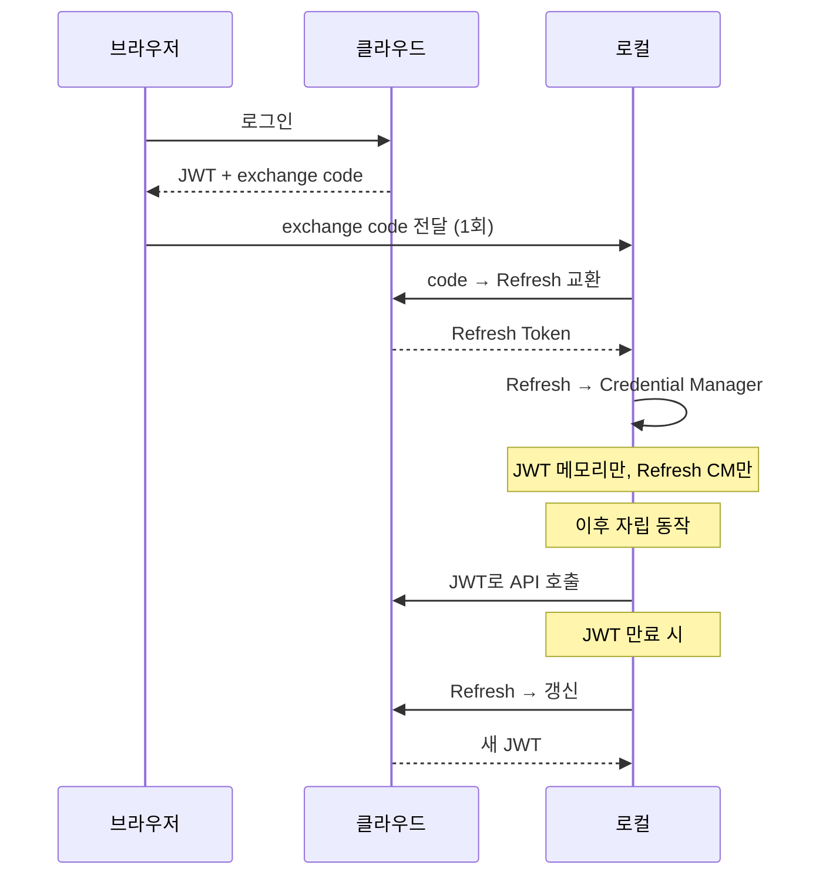
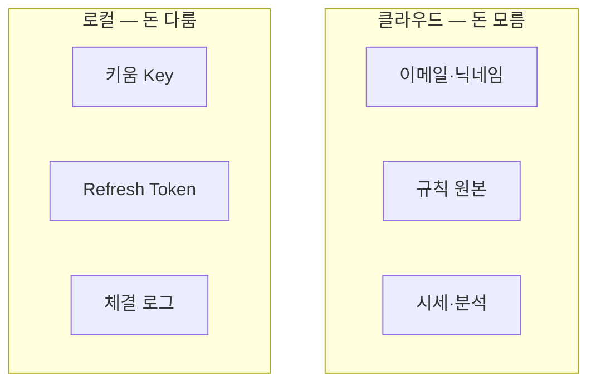
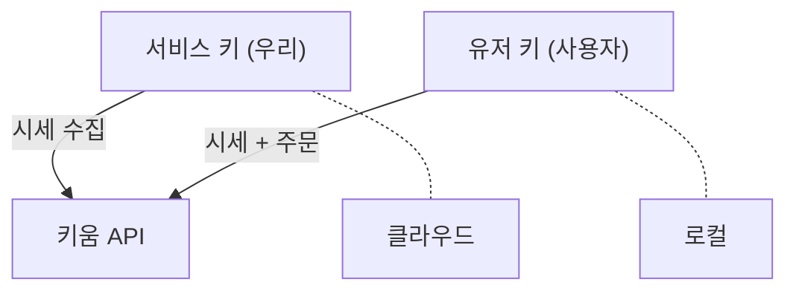
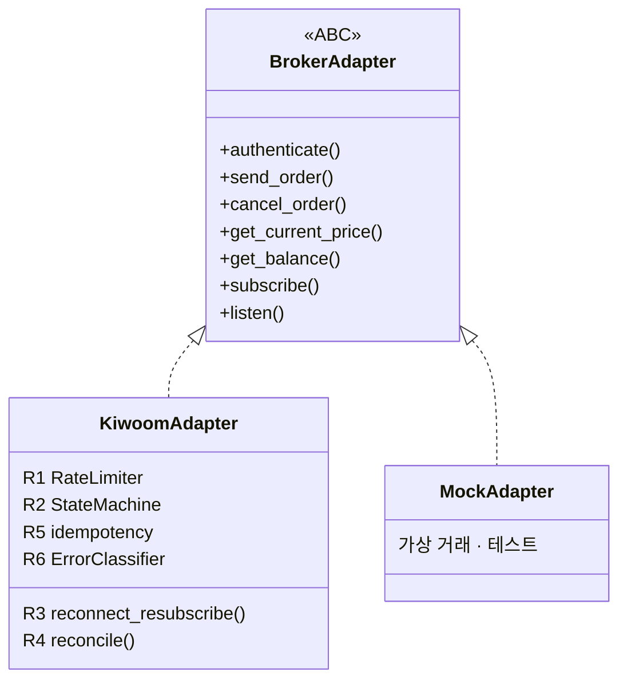
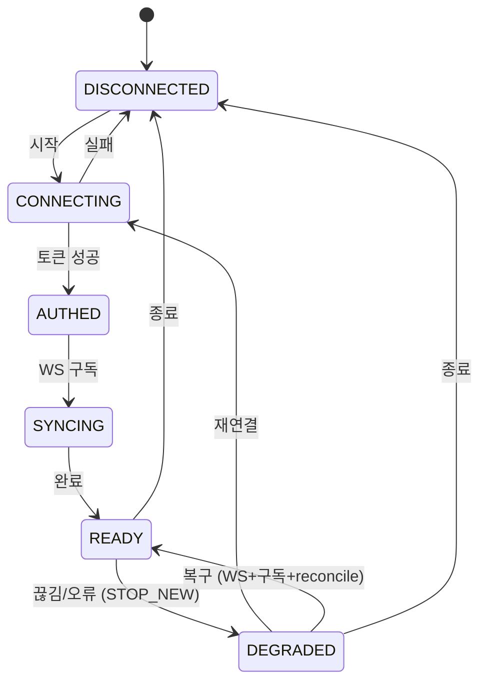

# StockVision 아키텍처 다이어그램

> 최종 갱신: 2026-03-05 (v3: DEGRADED 정책/reconcile/용어 통일) | `docs/architecture.md` 기반

---

## 1. 전체 시스템 구조

---

## 2. 주문 흐름

---

## 3. 규칙 동기화

---

## 4. 인증 흐름

---

## 5. 데이터 위치

---

## 6. 키 분리

---

## 7. BrokerAdapter

---

## 8. KiwoomAdapter 상태 머신

**READY 복귀 조건**: WS 연결 정상 + 구독 성공 + reconcile 1회 성공 (미체결/잔고/체결 정합)

**reconcile 원칙**: 키움 계좌 상태 = source of truth. 엔진 내부 상태(미체결/잔고)를 계좌 기준으로 보정.
