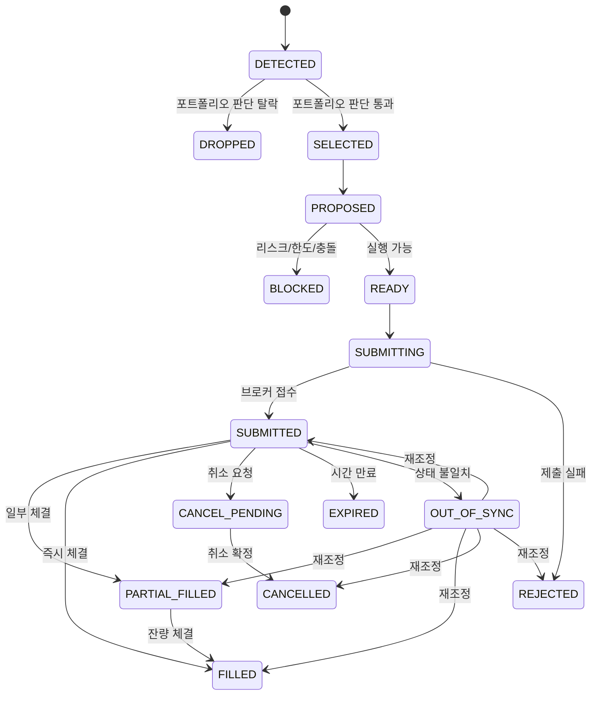

# System Trader 상태 모델 명세
작성일: 2026-03-10
상태: 초안 v1
관련 문서:
- `docs/product/system-trader-definition.md`
- `docs/product/system-trader-benchmark.md`
- `docs/product/assistant-copilot-engine-structure.md`

## 1. 목적

이 문서는 StockVision의 `System Trader`가 다뤄야 하는 상태를 정의한다.

핵심 원칙은 하나다.

`전략 신호`, `주문 의도`, `브로커 주문`, `글로벌 거래 모드`를 한 상태로 뭉개지 않는다.

그래야 아래가 가능해진다.

- 같은 분에 여러 전략이 동시에 신호를 내도 판단이 꼬이지 않기
- 제출된 주문과 체결된 주문을 구분하기
- 미체결, 부분 체결, 취소, 외부 주문을 추적하기
- 왜 주문이 막혔는지 설명하기

## 2. 상태 계층

System Trader는 아래 네 층의 상태를 가진다.

1. `Trading Mode`
시스템 전체가 지금 거래 가능한지, 줄이는 중인지, 멈춘 상태인지

2. `Candidate Signal`
전략 평가 결과로 나온 후보 신호

3. `Order Intent`
포트폴리오 판단을 통과해 실제 실행 후보가 된 의도

4. `Broker Order`
실브로커에 제출된 실제 주문 상태

## 3. Trading Mode 상태

### 3.1 정의

| 상태 | 의미 |
|---|---|
| `SYNCING` | 시작 직후 상태 동기화 중. 신규 판단 보류 |
| `ACTIVE` | 신규 진입/청산 모두 허용 |
| `REDUCING` | 신규 진입 금지, 기존 포지션 축소/청산만 허용 |
| `HALTED` | 모든 신규 주문 중지. 필요 시 취소만 허용 |

### 3.2 전이 규칙

- `SYNCING -> ACTIVE`
초기 계좌/주문/포지션 동기화 완료
- `ACTIVE -> REDUCING`
손실 한도 근접, 외부 주문 감지, 운영자 축소 모드 진입
- `ACTIVE -> HALTED`
킬스위치, 브로커 장애, 보안 사고 의심, 손실 락 발동
- `REDUCING -> HALTED`
추가 악화 또는 수동 중지
- `HALTED -> SYNCING`
재개 전 재동기화 필요
- `SYNCING -> HALTED`
초기 동기화 실패 또는 브로커 연결 불가

### 3.3 규칙

- `HALTED`에서는 신규 BUY intent를 생성하지 않는다.
- `REDUCING`에서는 신규 BUY intent를 생성하지 않는다.
- `SYNCING`에서는 전략 평가 결과를 `candidate`로만 남기고 실행하지 않는다.

## 4. Candidate Signal 상태

Candidate Signal은 전략 평가 결과다. 아직 포트폴리오 판단을 통과하지 않은 상태다.

### 4.1 정의

| 상태 | 의미 |
|---|---|
| `DETECTED` | 전략 조건 충족으로 후보 생성 |
| `DROPPED` | 포트폴리오 판단 전에 버려짐 |
| `SELECTED` | 포트폴리오 판단을 통과해 intent 생성 대상으로 채택 |

### 4.2 DROP 사유 예시

- 동일 종목 기존 intent 존재
- 포지션 수 초과
- 일일 예산 초과
- 우선순위 낮음
- 거래 모드가 `REDUCING` 또는 `HALTED`
- 미체결 주문과 충돌

### 4.3 규칙

- 같은 주기 안에서 `DETECTED -> DROPPED` 또는 `DETECTED -> SELECTED` 중 하나로 끝난다.
- Candidate Signal 자체는 장기 보관 대상이 아니라 `판단 로그` 대상이다.

## 5. Order Intent 상태

Order Intent는 System Trader가 포트폴리오 관점에서 채택한 실행 의도다.

### 5.1 정의

| 상태 | 의미 |
|---|---|
| `PROPOSED` | candidate에서 생성된 초기 intent |
| `BLOCKED` | 리스크/제약에 막혀 실행 불가 |
| `READY` | 실행 가능. 제출 대기 |
| `SUBMITTING` | Execution Layer에 제출 중 |
| `SUBMITTED` | 브로커가 주문을 접수함 |
| `PARTIAL_FILLED` | 일부 체결 |
| `FILLED` | 완전 체결 |
| `CANCEL_PENDING` | 취소 요청 전송됨 |
| `CANCELLED` | 취소 확정 |
| `REJECTED` | 브로커 또는 내부 규칙으로 거부 |
| `EXPIRED` | 유효 시간이 지나 무효 |
| `OUT_OF_SYNC` | 로컬 상태와 브로커 상태 불일치 |

### 5.2 핵심 원칙

- `SUBMITTED`는 `FILLED`가 아니다.
- `PARTIAL_FILLED`는 정상 상태다.
- `OUT_OF_SYNC`는 오류가 아니라 `재조정 필요 상태`다.
- `BLOCKED`는 candidate를 버린 것이 아니라 `의도 생성 후 차단 사유를 남긴 상태`다.

### 5.3 전이 규칙

- `PROPOSED -> BLOCKED`
리스크, 예산, 포지션, 중복 규칙 위반
- `PROPOSED -> READY`
실행 가능 판단 완료
- `READY -> SUBMITTING`
Execution Layer 제출 시작
- `SUBMITTING -> SUBMITTED`
브로커 접수 확인
- `SUBMITTING -> REJECTED`
브로커 즉시 거부 또는 제출 실패
- `SUBMITTED -> PARTIAL_FILLED`
부분 체결 수신
- `SUBMITTED -> FILLED`
완전 체결 수신
- `SUBMITTED -> CANCEL_PENDING`
취소 요청 전송
- `CANCEL_PENDING -> CANCELLED`
취소 확정
- `SUBMITTED -> EXPIRED`
장 종료 또는 TTL 만료
- `SUBMITTED -> OUT_OF_SYNC`
브로커와 로컬 상태 불일치 탐지
- `OUT_OF_SYNC -> SUBMITTED / PARTIAL_FILLED / FILLED / CANCELLED / REJECTED`
재조정 후 정상 상태 복귀

## 6. Broker Order 상태

Broker Order는 브로커가 제공하는 실제 주문 상태다.

최소 공통 상태:

- `SUBMITTED`
- `PARTIAL_FILLED`
- `FILLED`
- `CANCELLED`
- `REJECTED`
- `EXPIRED`

브로커별 세부 상태는 더 많을 수 있지만, StockVision 내부 공통 모델로는 위 정도면 충분하다.

## 7. 식별자 모델

상태 정합을 위해 최소 아래 식별자가 필요하다.

- `signal_id`
전략 평가 주기 안에서 생성된 후보 신호 ID
- `intent_id`
System Trader가 생성한 주문 의도 ID
- `client_order_id`
로컬이 브로커에 보내는 멱등성 키
- `broker_order_id`
브로커가 반환한 실제 주문 번호

권장 관계는 아래와 같다.

- 하나의 `signal_id`는 0개 또는 1개의 `intent_id`를 만든다.
- 하나의 `intent_id`는 1개 이상의 `broker_order_id`와 연결될 수 있다.
  - 정정/취소/재제출 대응

## 8. 상태 불변식

반드시 지켜야 하는 규칙:

1. `SUBMITTED` 이전에는 `broker_order_id`가 없어도 된다.
2. `FILLED` 이후에는 같은 intent에서 신규 BUY/SELL 제출을 다시 만들지 않는다.
3. `HALTED`일 때는 새로운 BUY intent를 만들지 않는다.
4. 하나의 심볼에 대해 동시에 상충하는 BUY/SELL active intent를 두지 않는다.
5. `PARTIAL_FILLED` 수량은 항상 `0 < filled_qty < target_qty`를 만족해야 한다.
6. `OUT_OF_SYNC` intent는 다음 평가 주기 전에 reconciliation 우선 대상이 된다.

## 9. 로그 모델

System Trader는 최소 아래 로그를 남겨야 한다.

- candidate 생성 이유
- candidate drop 이유
- intent 채택 이유
- intent block 이유
- broker submission 결과
- partial fill / fill / cancel / reject 이벤트
- reconciliation 결과

이 로그가 있어야 Assistant도 나중에 설명을 붙일 수 있다.

## 10. 권장 데이터 흐름

## 11. 현재 구현과의 차이

현재 구현과 가장 큰 차이는 아래다.

- 지금은 `evaluate -> executor.execute -> success`가 거의 직결이다.
- 앞으로는 `evaluate -> candidate -> intent -> submit -> fill/reconcile`로 나뉘어야 한다.
- 지금은 `place_order` 직후 사실상 `filled`처럼 취급하는데, 상태 모델상 이건 `submitted`에 해당한다.

즉 상태 모델을 도입하면, 코드 구조도 자연스럽게 아래처럼 바뀌게 된다.

- `evaluator.py`: candidate 생성
- `system_trader.py`: candidate 선택과 intent 생성
- `executor.py`: intent 제출과 주문 이벤트 수집
- `reconciler.py`: 브로커 상태와 로컬 intent 정합

## 12. MVP 권장 축약안

MVP에선 아래만 먼저 구현해도 충분히 가치가 있다.

- Trading Mode: `SYNCING / ACTIVE / HALTED`
- Candidate Signal: `DETECTED / DROPPED / SELECTED`
- Order Intent: `PROPOSED / READY / SUBMITTED / PARTIAL_FILLED / FILLED / CANCELLED / REJECTED / OUT_OF_SYNC`

이 정도만 있어도 현재 구현보다 훨씬 `System Trader`에 가까워진다.