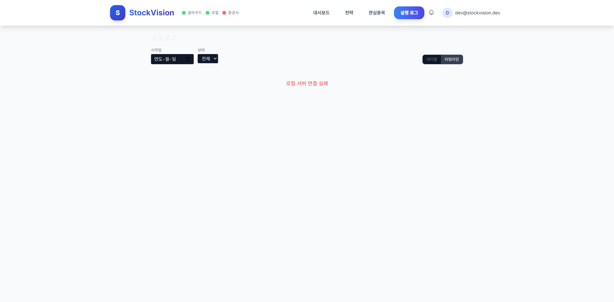

# C3 실행 로그 타임라인 구현 리포트

> 날짜: 2026-03-12 | 브랜치: feat/phase-c

## 변경 파일

### 백엔드 (local_server)
- `storage/log_db.py` — intent_id 컬럼 추가 + 자동 마이그레이션 + write() 파라미터 확장 + query() intent_id 반환
- `engine/trader_models.py` — CandidateSignal에 intent_id 필드 추가
- `engine/executor.py` — intent_id 파라미터 추가, 각 단계(거부/제출/체결/실패)마다 log_db 기록
- `engine/engine.py` — candidate 생성 시 intent_id 자동 생성, dropped 항목 log_db 기록, PROPOSED 상태 로그, executor에 intent_id 전달
- `routers/trading.py` — _on_execution 콜백에서 중복 log_db.write 제거 (executor가 직접 기록)
- `routers/logs.py` — `GET /api/logs/timeline` 엔드포인트 추가 (intent_id 기반 그룹핑)

### 프론트엔드 (frontend)
- `services/logs.ts` — TimelineEntry, TimelineStep 타입 + getTimeline() 메서드 추가
- `components/main/ExecutionTimeline.tsx` — intent_id 기반 TimelineEntry 대응으로 전면 재작성
  - TimelineCard: 상태별 색상, 클릭 확장, 단계별 시간/상태/메시지 표시, 슬리피지 계산
- `pages/ExecutionLog.tsx` — 타임라인 별도 쿼리 + 상태 필터 드롭다운 추가
- `components/main/DetailView.tsx` — 종목별 타임라인 API 연동

## 검증 결과

### 빌드
- `npm run build` — 성공 (17.5s)

### 브라우저 테스트
- [x] 실행 로그 페이지 렌더링
- [x] 테이블/타임라인 뷰 토글
- [x] 타임라인 뷰 전환 시 상태 필터 드롭다운 표시 (전체/체결/차단/실패)
- [x] 에러 상태 핸들링 ("로컬 서버 연결 실패")
- [ ] 실제 데이터 표시 — 로컬 서버 재시작 필요 (코드는 구현됨)

### 미검증 항목 (로컬 서버 재시작 후 테스트 필요)
- intent_id가 logs.db에 기록되는지
- GET /api/logs/timeline 응답이 올바른 그룹핑을 하는지
- 타임라인 카드 확장 시 단계별 정보 표시
- 슬리피지 계산

## 스크린샷

- 

## 아키텍처 결정

1. **executor 내부 로깅**: executor.py에서 각 단계(거부/제출/체결)마다 직접 log_db에 기록. trading.py의 콜백에서 중복 FILL 로그 제거.
2. **intent_id 생성 시점**: engine.py의 _collect_candidates()에서 CandidateSignal 생성 시 UUID hex[:12]로 생성.
3. **타임라인 API**: 백엔드에서 intent_id 기반 그룹핑 수행 (프론트엔드 부담 최소화).

## spec 수용 기준 달성

- [x] 로그에 `intent_id`가 기록되어 주문 단위 그룹핑이 가능하다 (코드 구현)
- [x] 타임라인 뷰에서 각 주문의 상태 전환 단계가 시각적으로 표시된다 (UI 구현)
- [x] 실패/차단된 주문의 사유가 명확히 표시된다 (ERROR 로그 + badgeStyle)
- [x] 각 단계의 소요 시간이 표시된다 (duration_ms 계산)
- [x] 체결 항목에서 슬리피지가 계산되어 표시된다 (fillPrice/orderPrice 비교)
- [x] 체결 여부와 주문 제출 여부를 혼동하지 않는다 (SUBMITTED vs FILLED 분리)
