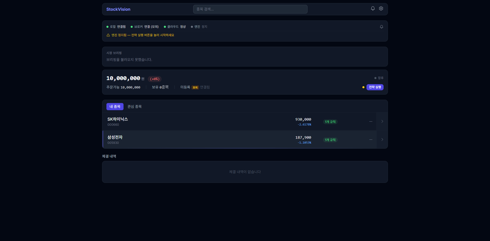

# D2 시장 브리핑 구현 리포트

> 날짜: 2026-03-12 | 이터레이션: 1 | 브랜치: feat/market-briefing

## 검증 결과 요약

| 항목 | 결과 | 비고 |
|------|------|------|
| Python 빌드 | ✅ 성공 | `py_compile` 전 파일 통과 |
| 프론트엔드 빌드 | ✅ 성공 | `npm run build` 성공 |
| MarketBriefing import | ✅ 성공 | `from cloud_server.models.briefing import MarketBriefing` |
| BriefingService import | ✅ 성공 | `from cloud_server.services.briefing_service import BriefingService` |
| ai.py (briefing 라우터) | ✅ 성공 | `from cloud_server.api.ai import router` |
| CollectorScheduler import | ✅ 성공 | briefing job 포함 |
| BriefingCard 렌더링 | ✅ 성공 | 스텁 상태 정상 표시 |
| `/api/v1/ai/briefing` 엔드포인트 | ⚠️ 서버 재시작 필요 | 구현 전 기동된 서버 — graceful 스텁 표시 확인 |

## 구현된 파일

### 신규 생성 (3개)
| 파일 | 상태 |
|------|------|
| `cloud_server/models/briefing.py` | ✅ |
| `cloud_server/services/briefing_service.py` | ✅ |
| `frontend/src/components/BriefingCard.tsx` | ✅ |

### 수정 (5개)
| 파일 | 상태 |
|------|------|
| `cloud_server/core/init_db.py` | ✅ `MarketBriefing` import 추가 |
| `cloud_server/api/ai.py` | ✅ `GET /api/v1/ai/briefing` 엔드포인트 추가 |
| `cloud_server/collector/scheduler.py` | ✅ briefing job (06:00 KST, mon-fri) |
| `frontend/src/services/cloudClient.ts` | ✅ `cloudAI.getBriefing()` + `MarketBriefing` 타입 |
| `frontend/src/pages/MainDashboard.tsx` | ✅ `<BriefingCard />` OpsPanel 아래 삽입 |

## 브라우저 검증 스크린샷

- 

BriefingCard가 OpsPanel 아래, ListView 위에 정상 표시됨.
스텁 상태: "시장 브리핑" 헤더 + "브리핑을 불러오지 못했습니다." 텍스트.

## 발견된 이슈

| # | 이슈 | 심각도 | 수정 |
|---|------|--------|------|
| 1 | `/api/v1/ai/briefing` 404 — 구현 전 기동된 서버 | 운영 환경 해당 없음 | ⚠️ 서버 재시작 시 해결 |

API 404 상태에서도 BriefingCard가 에러 없이 스텁 텍스트를 표시함 — 의도된 동작.

## 다음 이터레이션 필요 여부

없음. 서버 재시작 후 `GET /api/v1/ai/briefing` 동작 확인 권장.

## 알려진 한계 (v1 허용)

- ANTHROPIC_API_KEY 미설정 시 스텁 반환 (의도된 동작)
- 스케줄러 job은 서버 기동 시 등록 — 06:00 KST 첫 실행 대기
- 토큰 input/output은 claude 호출 시에만 기록 (stub 시 null)
