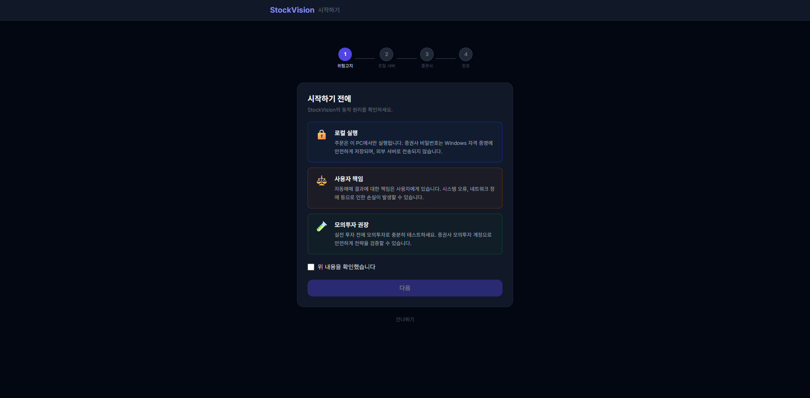
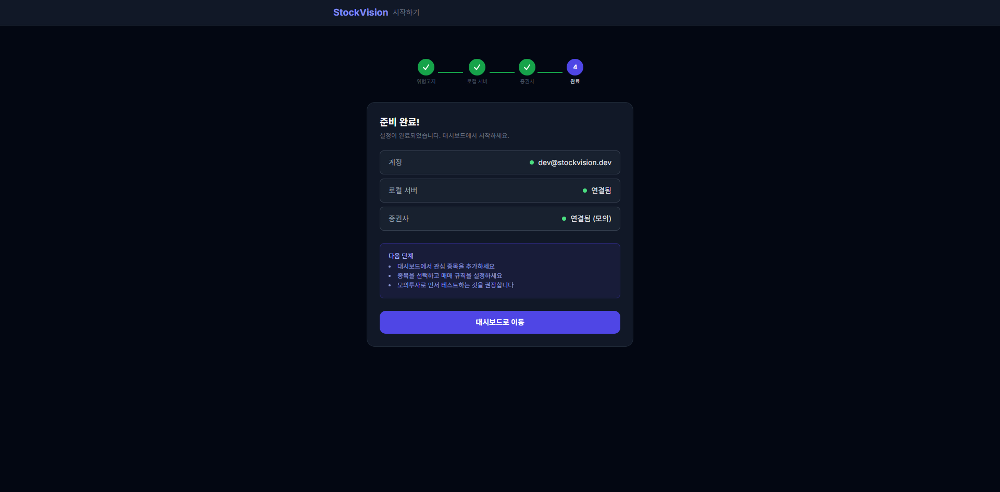

> 작성일: 2026-03-12

# 온보딩 v2 (C5) 구현 리포트

## 구현 결과

| Step | 내용 | 상태 | 파일 |
|------|------|------|------|
| 1 | 위험 고지 시각화 (카드 3개, 색상 구분) | 완료 | `RiskDisclosure.tsx` |
| 2 | 브릿지 설치 세분화 (맥락 설명, 상태 강화, 수동 안내) | 완료 | `BridgeInstaller.tsx` |
| 3 | 각 단계 맥락 설명 추가 | 완료 | `OnboardingWizard.tsx` |
| 4 | 요약 강화 (돌아가기 링크, 애니메이션) | 완료 | `OnboardingWizard.tsx` |

## 변경 파일

### 수정
- `frontend/src/components/onboarding/RiskDisclosure.tsx` — 카드 3개 색상 구분 (blue/yellow/green border), 아이콘 변경 (🔒/⚖️/🧪), 설명문 상세화
- `frontend/src/components/BridgeInstaller.tsx` — 맥락 설명 배너 추가, 진행 상태 시각화 강화 (animate-pulse, spinner), 포트 충돌 감지 메시지, 수동 실행 exe 경로 안내
- `frontend/src/pages/OnboardingWizard.tsx` — Step 2 subtitle 개선, SummaryRow에 onFix prop 추가 (미연결 → "설정하기" 링크), 대시보드 버튼 fadeIn 애니메이션
- `frontend/tailwind.config.js` — fadeIn keyframe 추가

## 검증

| 항목 | 결과 |
|------|------|
| 프론트엔드 빌드 | `npm run build` 성공 |
| Step 1 카드 렌더링 | 3개 카드 색상 구분 표시 확인 |
| Step 1 체크박스 → 다음 | checked=false 시 disabled, checked=true 시 enabled 확인 |
| Step 2 자동 스킵 | 로컬 서버 연결 시 자동 스킵 정상 |
| Step 3 자동 스킵 | 브로커 연결 시 자동 스킵 정상 |
| Step 4 요약 | 3개 연결 상태 초록 도트 + 값 표시 확인 |
| Step 4 대시보드 버튼 | fadeIn 애니메이션 적용 확인 |

## 스크린샷

- Step 1: 
- Step 4: 

## 미검증 항목

- Step 2 BridgeInstaller UI (로컬 서버 꺼진 상태에서만 표시 — 현재 서버 연결 중이라 자동 스킵)
  - 코드 리뷰로 검증: 맥락 설명 배너, 포트 충돌 감지, 수동 exe 경로 안내 구현 확인
- SummaryRow "설정하기" 링크 (모든 항목 ok=true이므로 미표시 — 정상 동작)
