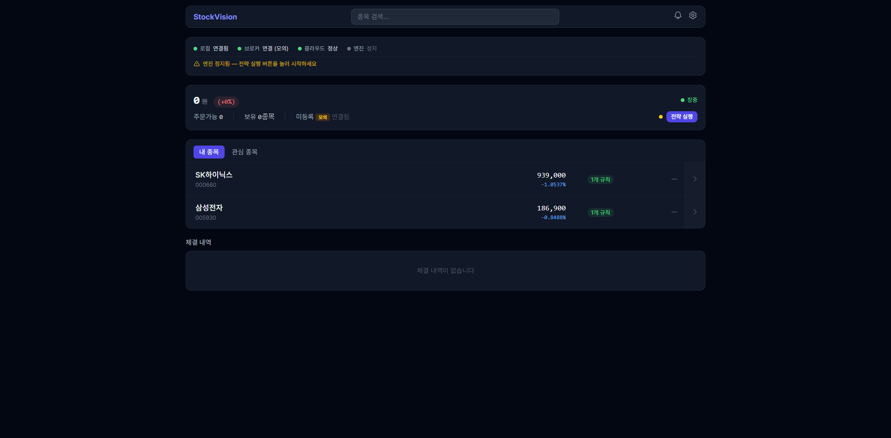
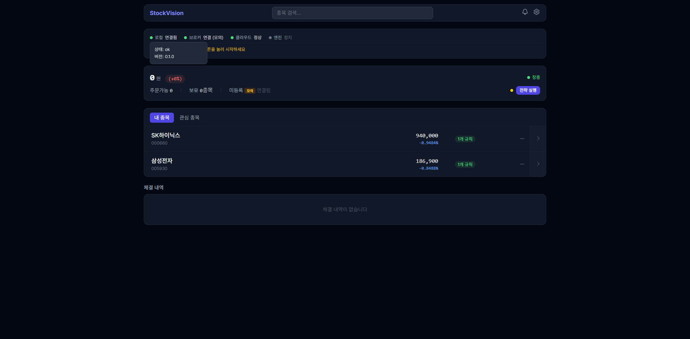
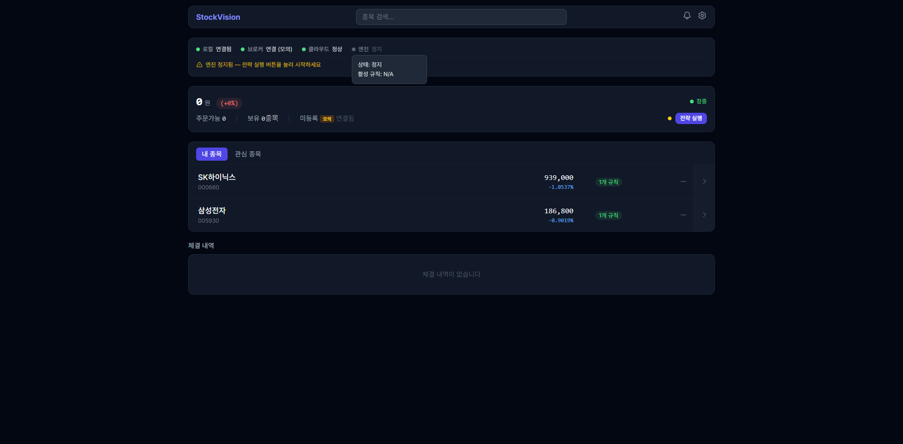

# C1+C2 OpsPanel v2 구현 리포트

> 날짜: 2026-03-12 | 브랜치: feat/phase-c

## 변경 파일

### 백엔드
- `local_server/routers/logs.py` — `GET /api/logs/daily-pnl` 엔드포인트 추가
  - 당일 FILL 로그에서 realized_pnl 합산, win/loss 카운트, win_rate 계산
  - Decimal 정밀도 사용

### 프론트엔드
- `frontend/src/services/localClient.ts` — `DailyPnL` 인터페이스 + `localLogs.dailyPnl()` 메서드 추가
- `frontend/src/components/main/OpsPanel.tsx` — 전면 재작성 (~285줄)
  - C1: 일일 P&L 표시 ("오늘: +32,000원", 초록/빨강/회색)
  - C1: 오늘의 요약 (신호/체결/오류 건수)
  - C2: 상태 도트 클릭 → 팝오버 드롭다운 (로컬/브로커/클라우드/엔진 상세)
  - C2: 경고 배너에 복구 액션 버튼 ("설정" → /settings 네비게이션)
  - C2: Kill Switch / 손실 락 긴급 배너
- `frontend/src/components/main/ListView.tsx` — `AccountInfo.dailyPnl` 필드 추가, 계좌바에 금액+퍼센트 표시
- `frontend/src/pages/MainDashboard.tsx` — dailyPnl 쿼리 추가, dailyReturn 계산, account 객체에 전달

## 검증 결과

### 빌드
- `npm run build` — 성공 (17.5s, chunk size warning만 존재)

### 브라우저 테스트
- [x] OpsPanel 렌더링 정상
- [x] 4개 상태 도트 표시 (로컬/브로커/클라우드/엔진)
- [x] 상태 도트 클릭 → 팝오버 표시
  - 로컬: 상태 ok, 버전 0.1.0
  - 엔진: 상태 정지, 활성 규칙 N/A
- [x] 팝오버 간 전환 가능 (z-index 수정 적용)
- [x] 경고 배너 + "설정" 액션 버튼 표시
- [x] 계좌바: 0원 (+0%) 표시
- [x] 장중 상태 표시

### 발견 이슈 (수정 완료)
1. **팝오버 z-index 문제**: 오버레이(`fixed inset-0 z-10`)가 버튼 클릭을 가로채서 팝오버 간 전환 불가
   - 수정: 버튼에 `relative z-20` 추가 → 오버레이 위에서 클릭 가능

### 콘솔 에러 (예상됨, 무시 가능)
- `404 /api/logs/daily-pnl` — 로컬 서버가 최신 코드로 재시작되지 않음
- `404 /api/logs/summary` — 동일
- `502 /api/account/balance` — 브로커 미인증 상태

## 스크린샷

- 
- 
- 

## spec 수용 기준 달성

### C1 (일일 P&L)
- [x] `GET /api/logs/daily-pnl` 엔드포인트
- [x] OpsPanel에 P&L 금액 표시
- [x] 계좌바에 금액 + 퍼센트 표시
- [x] 양수 초록, 음수 빨강, 0 회색

### C2 (OpsPanel 확장)
- [x] 상태 도트 클릭 → 상세 드롭다운
- [x] 경고 배너 + 복구 액션 버튼
- [x] Kill Switch / 손실 락 긴급 배너
- [x] 오늘의 요약 (신호/체결/오류)
