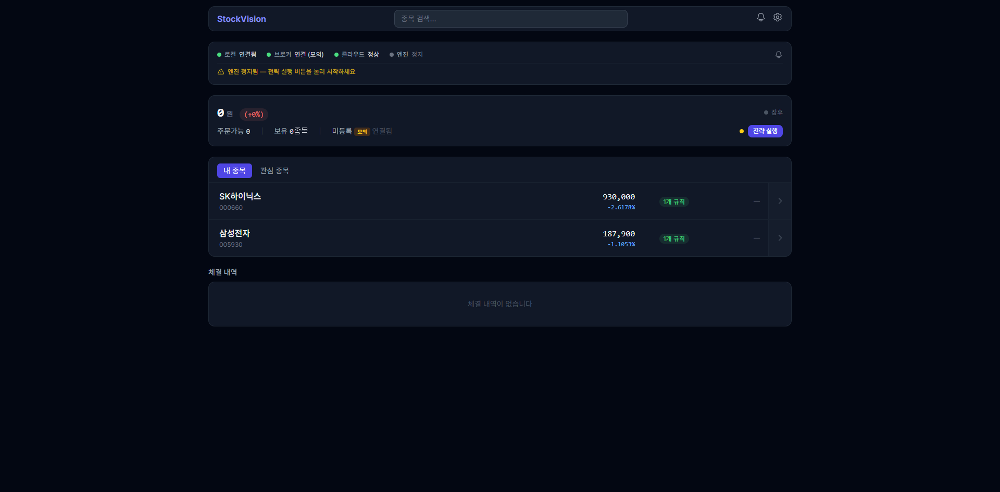
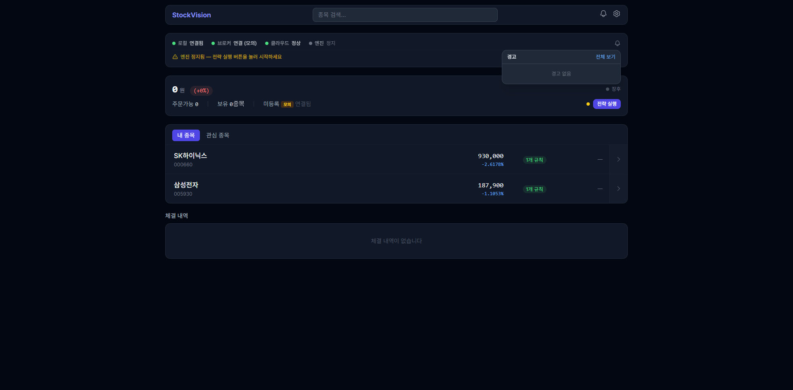
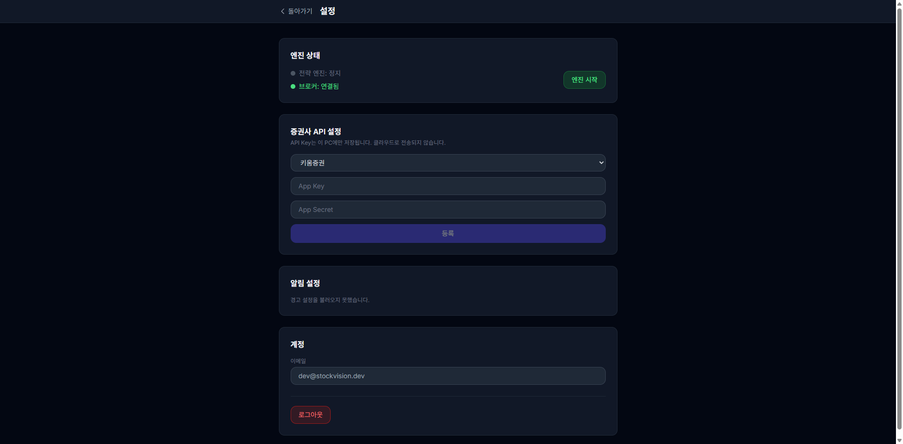
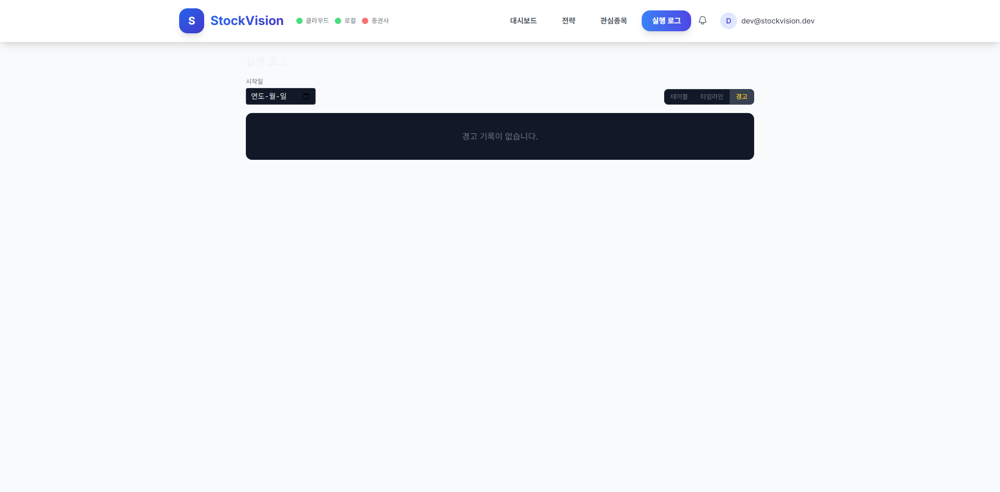

# 장중 실시간 경고 구현 리포트

> 날짜: 2026-03-12 | 이터레이션: 2 | 브랜치: feat/realtime-alerts

## 검증 결과 요약

| 항목 | 결과 | 비고 |
|------|------|------|
| Python 빌드 | ✅ 성공 | `py_compile` 전 파일 통과 |
| 프론트엔드 빌드 | ✅ 성공 | `npm run build` 성공 (이터레이션 2 포함) |
| AlertMonitor import | ✅ 성공 | `from local_server.engine.alert_monitor import AlertMonitor` |
| HealthWatchdog import | ✅ 성공 | `from local_server.engine.health_watchdog import HealthWatchdog` |
| main.py (alerts 라우터) | ✅ 성공 | `create_app()` 실행 확인 |
| OpsPanel AlertsDropdown | ✅ 성공 | 벨 아이콘 렌더링, 드롭다운 열림, "경고 없음" 표시 |
| AlertsDropdown 빈 상태 | ✅ 성공 | "경고 없음" 텍스트 정상 표시 |
| ExecutionLog 경고 탭 | ✅ 성공 | 탭 버튼 표시, "경고 기록이 없습니다." 표시 |
| `?tab=alerts` URL 파라미터 | ✅ 수정 후 성공 | 버그 발견 → 수정 (이터레이션 2) |
| AlertSettings API | ⚠️ 서버 재시작 필요 | 구현 전 기동된 서버 — graceful 에러 표시 확인 |

## 구현된 파일

### 신규 생성 (6개)
| 파일 | 상태 |
|------|------|
| `local_server/engine/alert_monitor.py` | ✅ |
| `local_server/engine/health_watchdog.py` | ✅ |
| `local_server/routers/alerts.py` | ✅ |
| `frontend/src/components/AlertsDropdown.tsx` | ✅ |
| `frontend/src/components/AlertSettings.tsx` | ✅ |
| `frontend/src/services/alertsClient.ts` | ✅ |

### 수정 (10개)
| 파일 | 상태 |
|------|------|
| `local_server/config.py` | ✅ `alerts` 섹션 추가 |
| `local_server/storage/log_db.py` | ✅ `LOG_TYPE_ALERT` + count_by_type |
| `local_server/engine/engine.py` | ✅ AlertMonitor 연동, open_orders 조회, _last_evaluate_ts |
| `local_server/routers/ws.py` | ✅ `WS_TYPE_ALERT` 상수 |
| `local_server/main.py` | ✅ alerts 라우터 + HealthWatchdog |
| `frontend/src/hooks/useLocalBridgeWS.ts` | ✅ alert 핸들러 + Notification 확장 |
| `frontend/src/components/main/OpsPanel.tsx` | ✅ AlertsDropdown 삽입 |
| `frontend/src/pages/Settings.tsx` | ✅ AlertSettings 섹션 |
| `frontend/src/pages/ExecutionLog.tsx` | ✅ 경고 탭 + `?tab=alerts` URL 파라미터 초기화 (이터레이션 2) |
| `frontend/src/stores/toastStore.ts` | ✅ persistent 옵션 |

## 발견된 이슈

### 이터레이션 2 (브라우저 런타임 검증)

| # | 이슈 | 심각도 | 수정 |
|---|------|--------|------|
| 1 | `?tab=alerts` URL 파라미터 무시 — AlertsDropdown "전체 보기" 클릭 시 경고 탭 미활성화 | 중간 | ✅ `useSearchParams` 추가로 수정 |
| 2 | AlertSettings API 404 — 서버가 구현 전에 기동된 상태 | 운영 환경 해당 없음 | ⚠️ 서버 재시작 시 해결 |

## 브라우저 검증 스크린샷

- 
- 
- 
- 
- 

## 다음 이터레이션 필요 여부

없음. 서버 재시작 후 AlertSettings 동작 확인 권장 (엔드포인트 코드는 검증 완료).

## 알려진 한계 (v1 허용)

- AlertMonitor 쿨다운 상태는 인메모리 — 서버 재시작 시 소실
- HealthWatchdog의 broker ping이 `get_balance()` 호출로 구현됨 (전용 ping 없음)
- Web Notification은 브라우저 권한 허용 시에만 동작 (Settings에서 권한 요청 버튼 미구현)
