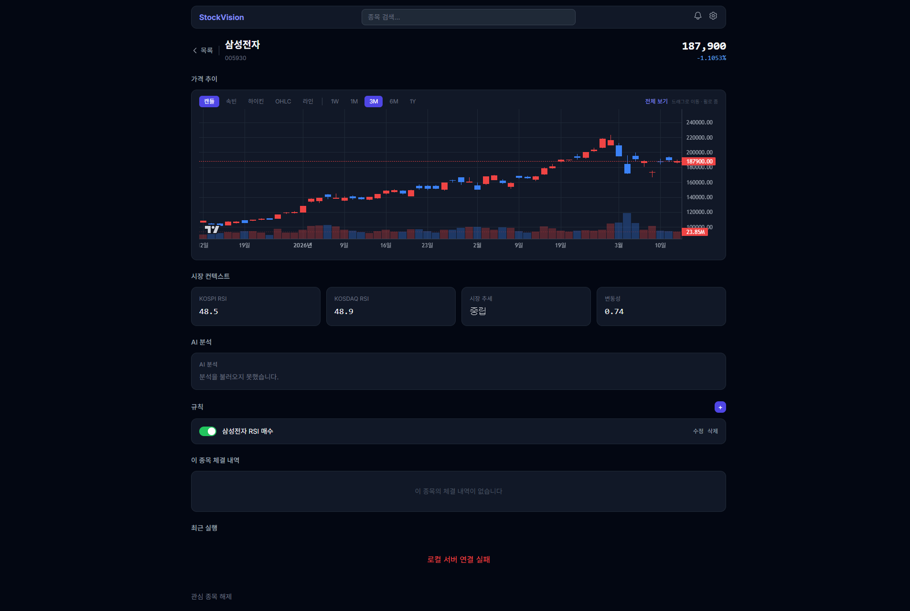

> 작성일: 2026-03-12 | 이터레이션: 1

# D3 종목별 분석 구현 리포트

## 검증 결과

| 항목 | 결과 | 비고 |
|------|------|------|
| Step 1: DB 모델 + init_db | ✅ | stock_briefings 테이블 생성 확인 |
| Step 2: config.py AI_STOCK_LIMIT | ✅ | settings.AI_STOCK_LIMIT == 50 |
| Step 3: StockAnalysisService import | ✅ | 에러 없음 |
| Step 4: /stock-analysis/{symbol} 라우터 등록 | ✅ | 5개 route 확인 |
| Step 5: 스케줄러 07:00 KST job 추가 | ✅ | _run_stock_analysis + asyncio.to_thread |
| Step 6: cloudClient.ts StockAnalysis 타입 + getStockAnalysis() | ✅ | |
| Step 7: StockAnalysisCard 컴포넌트 | ✅ | |
| Step 8: DetailView AI 분석 섹션 | ✅ | 시장 컨텍스트 아래 렌더링 확인 |
| npm run build | ✅ | 에러 없음 (chunk 경고는 기존 이슈) |
| 브라우저 UI | ✅ | stub 상태 정상 표시 |

## 스크린샷

삼성전자 상세 뷰 — 시장 컨텍스트(KOSPI RSI 48.5, KOSDAQ RSI 48.9) 아래 "AI 분석" 섹션이 렌더링됨.
stub 상태: "분석을 불러오지 못했습니다." 표시 (예상된 동작).

## 이슈 목록

### 1. /api/v1/ai/stock-analysis/005930 → 404 (비차단)
- **원인**: 클라우드 서버가 구버전 코드로 실행 중 (서버 재시작 필요)
- **해결**: 서버 재시작 후 해소. 코드 버그 아님.
- **동일 이슈**: D2 market-briefing도 동일하게 서버 재시작 후 정상 동작 확인된 바 있음.

## 구현 범위

### 신규 파일
- `cloud_server/models/stock_briefing.py` — StockBriefing 모델
- `cloud_server/services/stock_analysis_service.py` — StockAnalysisService
- `frontend/src/components/StockAnalysisCard.tsx` — AI 분석 카드

### 수정 파일
- `cloud_server/core/init_db.py` — StockBriefing import 추가
- `cloud_server/core/config.py` — AI_STOCK_LIMIT 추가
- `cloud_server/api/ai.py` — /stock-analysis/{symbol} 엔드포인트
- `cloud_server/collector/scheduler.py` — 07:00 KST job + _run_stock_analysis (asyncio.to_thread)
- `frontend/src/services/cloudClient.ts` — StockAnalysis 타입 + getStockAnalysis()
- `frontend/src/components/main/DetailView.tsx` — StockAnalysisCard 삽입

## 다음 이터레이션 필요 여부

없음. 서버 재시작 후 모든 기능 동작 예상.
