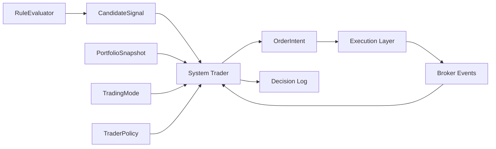

# System Trader 설계 명세서

> 작성일: 2026-03-10 | 상태: 구현 완료
> 관련 문서:
> - `docs/product/system-trader-definition.md`
> - `docs/product/system-trader-benchmark.md`
> - `docs/product/system-trader-state-model.md`
> - `docs/product/assistant-copilot-engine-structure.md`
> - `spec/strategy-engine/spec.md`

---

## 1. 목표

System Trader는 `전략 평가 결과`와 `주문 실행` 사이에 들어가는 포트폴리오 판단 계층이다.

현재 엔진은 대체로 아래 흐름이다.

`evaluate(rule) -> executor.execute(rule)`

System Trader 도입 후 목표 흐름은 아래와 같다.

`evaluate(rule) -> candidate signal -> system trader -> order intent -> execution layer`

이 계층을 추가하는 목적은 다음과 같다.

- 여러 전략이 동시에 낸 신호를 한 주기 안에서 함께 판단하기
- 포지션 수, 현금, 미체결 주문, 종목 중복을 포트폴리오 관점에서 조정하기
- `submitted`와 `filled`를 분리해 실브로커 상태를 올바르게 추적하기
- 외부 주문/체결과의 정합성을 맞추기
- 나중에 Assistant가 설명 가능한 결정 로그를 남기기

---

## 2. 비목표

System Trader는 아래를 하지 않는다.

- 자연어 대화
- 전략 DSL 생성
- 뉴스/리포트 요약
- 브로커 API 직접 호출
- 키 저장

즉 LLM 역할과 실행 역할을 모두 제외한 `결정 계층`만 담당한다.

---

## 3. 책임 범위

### 3.1 입력

System Trader의 입력은 아래 네 가지다.

1. `CandidateSignal[]`
각 전략 평가가 만든 BUY/SELL 후보

2. `PortfolioSnapshot`
현재 포지션, 현금, 미체결 주문, 당일 사용 예산, 외부 주문 감지 상태

3. `TradingMode`
`SYNCING`, `ACTIVE`, `REDUCING`, `HALTED`

4. `TraderPolicy`
최대 포지션 수, 예산 비율, 동일 종목 중복 정책, 우선순위 정책

### 3.2 출력

System Trader의 출력은 아래 두 가지다.

1. `TradeDecisionBatch`
이 주기에서 채택/차단된 결과 묶음

2. `OrderIntent[]`
실제 실행 계층으로 내려보낼 주문 의도

### 3.3 핵심 책임

- 후보 신호 수집과 정규화
- 포트폴리오 스냅샷 기반 우선순위 결정
- 종목 중복/전략 충돌 해소
- 포지션 슬롯과 예산 배분
- `OrderIntent` 생성과 상태 갱신
- 브로커 이벤트 반영과 정합성 재조정 요청
- 결정 이유 로깅

---

## 4. 아키텍처



### 4.1 계층 분리

- `RuleEvaluator`
  - 전략별 조건 평가
  - BUY/SELL 후보만 생성
- `System Trader`
  - 후보들을 포트폴리오 차원에서 선택/차단
  - intent 생성
- `Execution Layer`
  - intent 제출, 취소, 체결 추적
- `Reconciler`
  - 브로커 상태와 로컬 상태 정합

---

## 5. 제안 모듈 구조

초기 구현 기준 권장 파일 구조:

- `local_server/engine/system_trader.py`
  - SystemTrader 본체
- `local_server/engine/trader_models.py`
  - CandidateSignal, PortfolioSnapshot, OrderIntent, TradeDecisionBatch
- `local_server/engine/trader_policy.py`
  - 정책 객체와 선택 전략
- `local_server/engine/trader_state.py`
  - TradingMode, 상태 전이 유틸리티
- `local_server/engine/intent_store.py`
  - inflight intent 조회/갱신 저장소
- `local_server/engine/reconciler.py`
  - 브로커 open order / fill 이벤트 재조정

초기 단계에서는 새 파일 수를 줄이기 위해 일부를 `models.py`와 `system_trader.py`에 합쳐도 된다. 다만 개념적 책임은 분리해 두는 것이 좋다.

---

## 6. 데이터 모델

### 6.1 CandidateSignal

```python
@dataclass
class CandidateSignal:
    signal_id: str
    cycle_id: str
    rule_id: int
    symbol: str
    side: Literal["BUY", "SELL"]
    priority: int
    desired_qty: int
    detected_at: datetime
    latest_price: Decimal
    reason: str
    raw_rule: dict[str, Any]
```

설명:

- RuleEvaluator의 결과물
- 아직 포트폴리오 판단 전
- `desired_qty`는 전략이 원하는 수량이며 최종 수량이 아님

### 6.2 PortfolioSnapshot

```python
@dataclass
class PortfolioSnapshot:
    as_of: datetime
    cash: Decimal
    positions: list[Position]
    open_orders: list[OpenOrderView]
    intents_inflight: list[OrderIntent]
    daily_budget_used: Decimal
    external_order_detected: bool = False
```

설명:

- System Trader는 항상 이 스냅샷 기준으로 판단한다.
- 같은 주기 안에서 intent가 채택되면 snapshot view를 갱신한 것처럼 다뤄야 한다.

### 6.3 OrderIntent

```python
@dataclass
class OrderIntent:
    intent_id: str
    cycle_id: str
    source_signal_id: str
    rule_id: int
    symbol: str
    side: Literal["BUY", "SELL"]
    target_qty: int
    submitted_qty: int = 0
    filled_qty: int = 0
    state: IntentState = IntentState.PROPOSED
    blocked_reason: str | None = None
    client_order_id: str | None = None
    broker_order_id: str | None = None
    created_at: datetime = field(default_factory=datetime.now)
    updated_at: datetime = field(default_factory=datetime.now)
```

설명:

- System Trader와 Execution Layer의 공통 계약 객체
- `target_qty`와 `filled_qty`를 분리해 partial fill을 추적한다.

### 6.4 TradeDecisionBatch

```python
@dataclass
class TradeDecisionBatch:
    cycle_id: str
    selected_signals: list[CandidateSignal]
    dropped_signals: list[tuple[CandidateSignal, str]]
    intents_to_submit: list[OrderIntent]
    blocked_intents: list[OrderIntent]
```

설명:

- 한 평가 주기의 결과를 통째로 기록하기 위한 객체

---

## 7. 정책 모델

### 7.1 기본 정책

MVP에서는 아래 정책만 먼저 둔다.

- `priority_desc`
우선순위 높은 전략부터 처리
- `single_position_per_symbol`
동일 종목 동시 진입 금지
- `max_positions`
남은 포지션 슬롯 내에서만 신규 진입
- `daily_budget_ratio`
당일 사용 예산 초과 금지
- `buy_block_in_reducing_mode`
`REDUCING`, `HALTED`에서 신규 BUY 금지

### 7.2 차단 사유 코드

차단은 문자열이 아니라 코드로 기록하는 편이 좋다.

```python
class BlockReason(str, Enum):
    HALTED = "HALTED"
    REDUCING_MODE = "REDUCING_MODE"
    DUPLICATE_SYMBOL = "DUPLICATE_SYMBOL"
    MAX_POSITIONS = "MAX_POSITIONS"
    DAILY_BUDGET_EXCEEDED = "DAILY_BUDGET_EXCEEDED"
    OPEN_ORDER_CONFLICT = "OPEN_ORDER_CONFLICT"
    LOWER_PRIORITY = "LOWER_PRIORITY"
    NO_HOLDING = "NO_HOLDING"
    UNKNOWN = "UNKNOWN"
```

---

## 8. 실행 권한 모델

System Trader는 `주문마다 승인`을 전제로 하지 않는다.

자동매매의 기본 모델은 `엔진 무장(arm) 세션`이다.

### 8.1 원칙

- 사용자는 전략, 종목 범위, 예산, 포지션 수, 시간대를 먼저 설정한다.
- 자동 주문은 `무장된 세션` 안에서만 허용된다.
- 세션이 만료되거나 해제되면 신규 자동 주문은 즉시 중지된다.
- 원격 자연어 즉시 주문은 자동전략 주문과 같은 권한으로 취급하지 않는다.

### 8.2 권한 단계

1. `조회 권한`
항상 허용 가능

2. `전략 실행 권한`
무장된 세션 안에서만 허용

3. `원격 수동 즉시 주문 권한`
별도 고위험 권한. MVP에서는 금지 또는 매우 제한

### 8.3 Engine Arm Session

```python
@dataclass
class ArmSession:
    session_id: str
    armed_at: datetime
    expires_at: datetime
    mode: Literal["LOCAL", "REMOTE_APPROVED"]
    active: bool = True
    allow_auto_strategy_orders: bool = True
    allow_remote_manual_orders: bool = False
    max_order_amount: Decimal | None = None
    max_daily_loss_pct: Decimal | None = None
```

설명:

- `LOCAL`
  - 같은 PC에서 사용자가 직접 무장한 세션
- `REMOTE_APPROVED`
  - 원격에서 재개되었지만 추가 확인을 거친 세션

### 8.4 세션 전이

- `DISARMED -> ARMED`
  - 사용자가 엔진 시동 또는 자동매매 시작을 승인
- `ARMED -> EXPIRED`
  - 장 종료, TTL 만료, 사용자가 정한 시간 도달
- `ARMED -> DISARMED`
  - 사용자가 중지
- `ARMED -> HALTED`
  - 킬스위치, 손실 락, 브로커 장애, 보안 사고 의심
- `HALTED -> DISARMED`
  - 문제 확인 후 세션 종료
- `HALTED -> ARMED`
  - 허용하지 않음. 반드시 재무장 필요

### 8.5 자동 주문 허용 조건

자동 전략 주문은 아래를 모두 만족할 때만 허용한다.

- `TradingMode == ACTIVE`
- 유효한 `ArmSession` 존재
- `allow_auto_strategy_orders == True`
- 해당 전략이 활성화 상태
- 정책상 예산/포지션/중복 제한 충족

### 8.6 재무장이 필요한 경우

아래 상황에서는 기존 세션을 신뢰하지 않고 재무장이 필요하다.

- 앱 재시작
- 브로커 재연결 후 계좌 정합성 불확실
- 킬스위치 발동
- 손실 락 발동
- 보안 사고 또는 외부 주문 의심 후 강제 정지

### 8.7 MVP 권고

- 자동전략 주문은 `무장 세션` 안에서만 허용
- 세션 유효기간은 기본 `당일 장 종료까지`
- 원격에서는 `중지(stop)`는 쉽게, `재개(arm)`는 어렵게
- 원격 수동 즉시 주문은 MVP에서 금지

---

## 9. 상태 모델 적용

System Trader는 `docs/product/system-trader-state-model.md`를 구현 규약으로 사용한다.

초기 구현에 필요한 최소 상태:

- TradingMode
  - `SYNCING`, `ACTIVE`, `HALTED`
- CandidateSignal
  - `DETECTED`, `DROPPED`, `SELECTED`
- OrderIntent
  - `PROPOSED`, `BLOCKED`, `READY`, `SUBMITTED`, `PARTIAL_FILLED`, `FILLED`, `CANCELLED`, `REJECTED`, `OUT_OF_SYNC`

중요한 규칙:

- `place_order()` 성공은 `SUBMITTED`다. `FILLED`가 아니다.
- 체결 이벤트 또는 reconciliation 결과가 와야 `FILLED`로 바뀐다.
- 같은 intent는 두 번 제출하지 않는다.

---

## 10. 사이클 설계

### 9.1 평가 주기

한 평가 주기에서 아래 순서를 따른다.

1. `PortfolioSnapshot` 생성
2. 모든 활성 규칙 평가
3. `CandidateSignal[]` 생성
4. System Trader가 후보를 정렬
5. 각 후보를 순서대로 검토하며 `selected / dropped` 결정
6. `OrderIntent[]` 생성
7. `READY` intent만 Execution Layer로 제출
8. 제출 결과를 intent 상태에 반영
9. 배치 로그 저장

### 9.2 중요한 차이

현재 구현은 `for rule -> execute`인데, 목표 구현은 `for cycle -> collect -> decide -> submit`이다.

이 차이가 바로 System Trader 유무를 가른다.

---

## 11. 핵심 인터페이스

### 10.1 SystemTrader

```python
class SystemTrader:
    def __init__(self, policy: TraderPolicy, intent_store: IntentStore) -> None: ...

    def process_cycle(
        self,
        *,
        cycle_id: str,
        mode: TradingMode,
        snapshot: PortfolioSnapshot,
        candidates: list[CandidateSignal],
    ) -> TradeDecisionBatch: ...

    def on_order_submitted(
        self,
        intent_id: str,
        client_order_id: str,
        broker_order_id: str,
    ) -> None: ...

    def on_order_event(self, event: BrokerOrderEvent) -> None: ...

    def reconcile(self, broker_orders: list[BrokerOrderView]) -> list[OrderIntent]: ...
```

### 10.2 IntentStore

```python
class IntentStore(Protocol):
    def list_inflight(self) -> list[OrderIntent]: ...
    def get(self, intent_id: str) -> OrderIntent | None: ...
    def save(self, intent: OrderIntent) -> None: ...
    def update_state(self, intent_id: str, state: IntentState, **kwargs) -> None: ...
```

MVP에서는 메모리 구현으로 시작해도 된다. 다만 인터페이스를 먼저 두면 나중에 SQLite나 logs.db 연동으로 바꾸기 쉽다.

---

## 12. 현재 코드에서 바꿔야 할 흐름

### 11.1 StrategyEngine.evaluate_all

현재:

- balance 조회
- rule 평가
- 조건 충족 시 즉시 executor 호출

목표:

- balance + open orders + inflight intents 조회
- rule 평가
- candidate 수집
- system_trader.process_cycle 호출
- intents_to_submit만 executor 호출

### 11.2 OrderExecutor

현재:

- rule dict를 직접 받아 주문 실행
- place_order 이후 사실상 filled 취급

목표:

- `OrderIntent`를 입력으로 받음
- place_order 성공 시 `SUBMITTED`만 반영
- fill / partial fill / cancel / reject는 브로커 이벤트 또는 reconciliation으로 갱신

### 11.3 LimitChecker / Safeguard

현재:

- executor 내부에서 즉시 차단

목표:

- Safeguard는 절대 금지 규칙
- LimitChecker는 System Trader의 선택 로직 안에서 먼저 적용
- Execution Layer에서는 마지막 방어선으로 한 번 더 확인

즉 `선택 단계 차단`과 `실행 단계 차단`을 둘 다 두되, 역할을 분리한다.

---

## 13. 점진적 도입 순서

### Phase 1

- CandidateSignal 모델 추가
- evaluate_all이 즉시 주문 대신 candidate를 모으게 수정
- SystemTrader.process_cycle 도입
- 같은 종목 중복 방지 + max_positions + 예산만 우선 적용

### Phase 2

- OrderIntent 모델 도입
- executor 입력을 rule -> intent로 변경
- `SUBMITTED`와 `FILLED` 분리
- inflight intent 저장소 도입

### Phase 3

- open order / fill reconciliation 도입
- external order 감지 훅 연결
- `REDUCING` 모드 도입
- decision log 고도화

---

## 14. 수용 기준

이 설계가 반영되었다고 보려면 아래를 만족해야 한다.

- 여러 규칙이 동시에 BUY 신호를 내도 포트폴리오 기준으로 하나씩 선택/차단된다.
- 동일 종목 중복 진입이 정책에 따라 일관되게 처리된다.
- `place_order()` 직후 intent는 `SUBMITTED` 상태다.
- 체결 이벤트가 들어와야 `FILLED`가 된다.
- 부분 체결과 취소가 intent 상태에 반영된다.
- 한 평가 주기의 selected / dropped / blocked 이유를 로그에서 볼 수 있다.

---

## 15. 한 줄 결론

System Trader 설계의 핵심은 `전략 신호를 바로 주문하지 않는 것`이다. 모든 것은 그 원칙에서 시작한다.