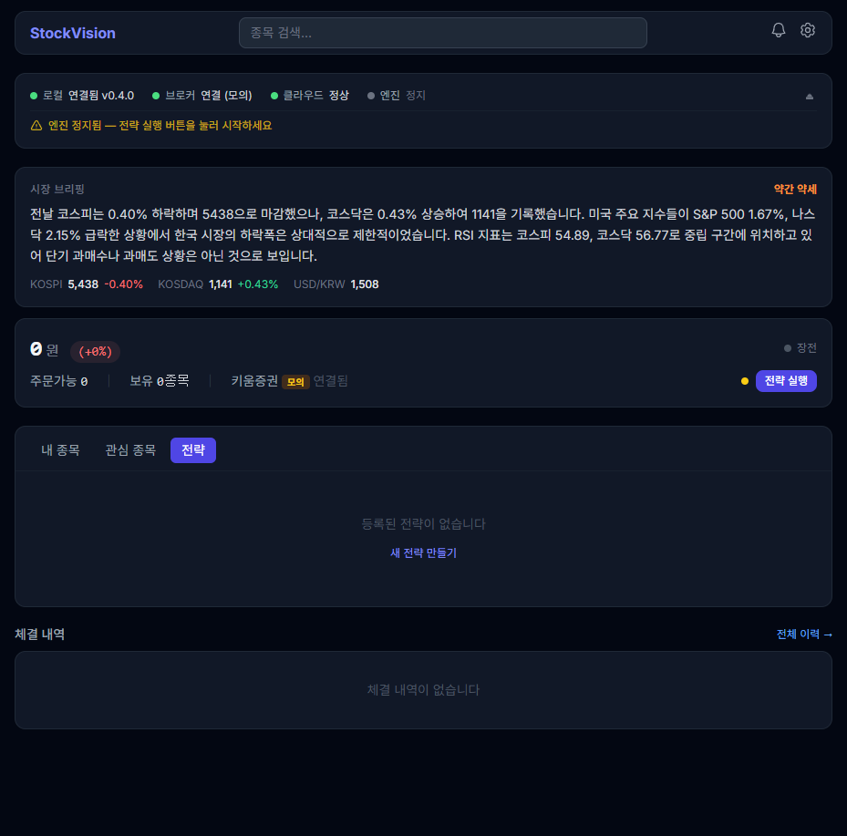
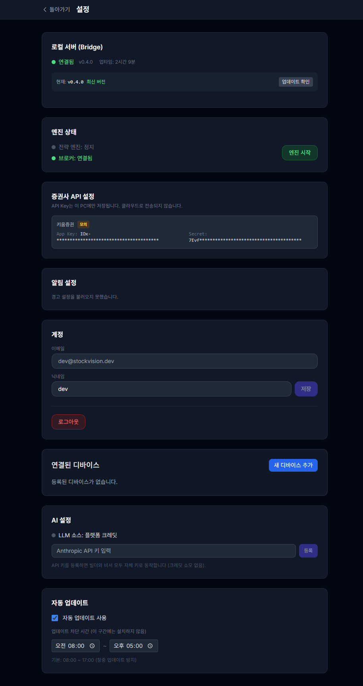

# v1 전수조사 — E2E 테스트 결과

> 2026-03-30 | Playwright MCP 수동 테스트

## 테스트 환경
- 프론트: http://localhost:5173 (Vite dev)
- 로컬 서버: http://localhost:4020 (v0.4.0, uptime 2h+)
- 클라우드: http://localhost:4010 (로컬 실행)
- 브로커: 키움 모의 연결됨

## 1. 인증 + 온보딩

| 항목 | 결과 | 비고 |
|------|------|------|
| 로그인 페이지 렌더링 | ✅ | 이메일/비밀번호/소셜 로그인 |
| 로그인 성공 → 대시보드 | ✅ | dev@stockvision.dev |
| 로그인 실패 에러 | ✅ | "이메일 또는 비밀번호가 올바르지 않습니다" |
| 약관 변경 모달 | ✅ | 체크박스 + 동의 버튼 |
| 온보딩 위자드 | ✅ | 4단계 (위험고지/로컬/증권사/완료) + 건너뛰기 |

## 2. 대시보드 (MainDashboard)

| 항목 | 결과 | 비고 |
|------|------|------|
| OpsPanel 로컬 상태 | ✅ | "연결됨 **v0.4.0**" — 버전 상시 표시 |
| OpsPanel 브로커 | ✅ | "연결 (모의)" |
| OpsPanel 클라우드 | ✅ | "정상" |
| OpsPanel 엔진 | ✅ | "정지" |
| 경고 배너 | ✅ | "엔진 정지됨 — 전략 실행 버튼을 눌러 시작하세요" |
| 시장 브리핑 | ✅ | KOSPI/KOSDAQ 지수 + RSI + 브리핑 텍스트 |
| 계좌 정보 | ✅ | 주문가능/보유/키움증권 모의 |
| "내 종목" 탭 | ✅ | 빈 상태 — "규칙이 설정된 종목이 없습니다" |
| "관심 종목" 탭 | ✅ | 빈 상태 |
| **"전략" 탭** | ✅ | **신규** — "등록된 전략이 없습니다" + "새 전략 만들기" |
| 체결 내역 | ✅ | 빈 상태 + "전체 이력 →" |
| 전략 실행 버튼 | ✅ | 존재 확인 |

## 3. 설정 (Settings)

| 항목 | 결과 | 비고 |
|------|------|------|
| Bridge 연결 상태 | ✅ | "연결됨 v0.4.0 업타임: 2시간 9분" |
| **BridgeUpdateInfo** | ✅ | **신규** — "현재: v0.4.0 최신 버전" + "업데이트 확인" |
| 엔진 상태 + 토글 | ✅ | 정지 + "엔진 시작" 버튼 |
| 증권사 API 키 | ✅ | 키움증권 모의, 키 마스킹 |
| 알림 설정 | ⚠️ | "경고 설정을 불러오지 못했습니다" (403 — 로컬 인증 토큰 미설정) |
| 계정 | ✅ | 이메일 + 닉네임 + 로그아웃 |
| 디바이스 관리 | ✅ | "등록된 디바이스가 없습니다" + "새 디바이스 추가" |
| **AI 설정** | ✅ | **신규** — "LLM 소스: 플랫폼 크레딧" + API 키 입력 폼 |
| 자동 업데이트 | ✅ | ON/OFF + 차단 시간 08:00~17:00 |

## 4. 전략 관리 (/strategies)

| 항목 | 결과 | 비고 |
|------|------|------|
| Layout 네비게이션 | ✅ | 대시보드/전략/백테스트/관심종목/실행 로그 |
| 전략 목록 | ✅ | "로딩 중..." (클라우드 rules API 403 — CORS) |
| "새 전략" 버튼 | ✅ | 존재 |
| 검색 입력 | ✅ | 존재 |

## 5. 백테스트 (/backtest)

| 항목 | 결과 | 비고 |
|------|------|------|
| 페이지 렌더링 | ✅ | Layout + 콘텐츠 영역 |

## 6. 실행 로그 (/logs)

| 항목 | 결과 | 비고 |
|------|------|------|
| 페이지 렌더링 | ✅ | 테이블/타임라인/경고 탭 |
| 필터 (시작일) | ✅ | 날짜 입력 존재 |

## 7. 관심종목 (/stocks)

| 항목 | 결과 | 비고 |
|------|------|------|
| 페이지 렌더링 | ✅ | 검색 + 빈 상태 |
| 종목 검색 입력 | ✅ | 존재 |

## 8. 콘솔 에러 분석

모든 페이지에서 반복되는 에러 2종:

| 에러 | 원인 | 심각도 |
|------|------|--------|
| `localhost:4020/api/auth/token` ERR_FAILED | 로컬 서버 인증 토큰 미설정 (개발 환경 특성) | ⚠️ 낮음 |
| `localhost:4010/api/v1/rules` CORS | 클라우드→로컬 CORS preflight 실패 | ⚠️ 낮음 |

두 에러 모두 **로컬 개발 환경 특성**으로, 정상 배포 시 발생하지 않음:
- 로컬 서버 인증: localSecret 설정 후 해소
- CORS: 프로덕션에서는 같은 도메인 사용

## 요약

| 카테고리 | 전체 | 통과 | 경고 | 실패 |
|---------|------|------|------|------|
| 인증 | 5 | 5 | 0 | 0 |
| 대시보드 | 12 | 12 | 0 | 0 |
| 설정 | 9 | 8 | 1 | 0 |
| 전략/백테스트/로그/관심 | 7 | 7 | 0 | 0 |
| **합계** | **33** | **32** | **1** | **0** |

**v1-polish 신규 기능 전수 확인:**
- ✅ F1-2: AI 설정 (BYO 키 입력 폼)
- ✅ F2: Sentry (코드 레벨 — UI 확인 불가, 코드 리뷰로 검증)
- ✅ F3: 포지션 동기화 (코드 레벨 — 엔진 실행 시 동작, 코드 리뷰로 검증)
- ✅ F4: 대시보드 전략 탭

**auto-update-improvement 기능 확인:**
- ✅ OpsPanel 버전 상시 표시 (v0.4.0)
- ✅ Settings BridgeUpdateInfo (현재/최신 버전 + 업데이트 확인)
- ✅ 자동 업데이트 설정 (ON/OFF + 차단 시간)
